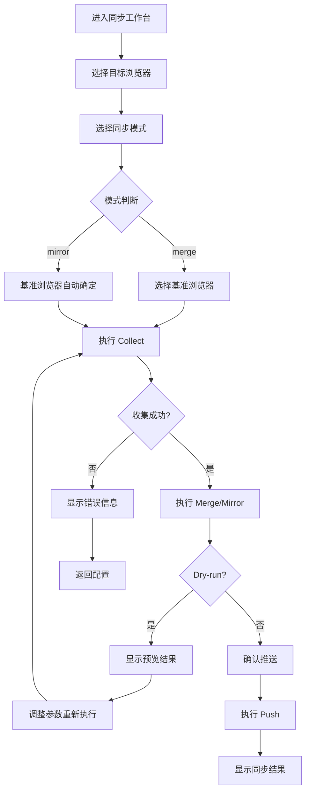
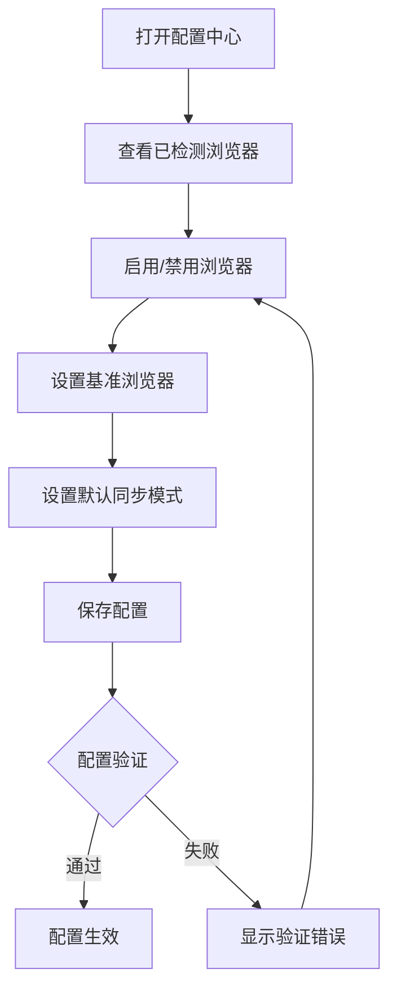

## 1. 产品概述

BrowserSync GUI 是跨浏览器书签同步工具 BrowserSync 的图形化交互界面，旨在将原 CLI 的所有核心功能完整迁移至可视化操作环境，让非技术用户也能轻松完成浏览器的书签收集、合并去重/镜像同步、推送等全流程操作。

- 解决痛点：原 CLI 工具对非技术用户门槛高，缺乏可视化反馈和操作引导
- 目标用户：有多浏览器书签同步需求的普通用户、前端开发者

## 2. 核心功能

### 2.1 用户角色
| 角色 | 交互方式 | 核心权限 |
|------|---------|----------|
| 普通用户 | 图形界面操作 | 浏览、配置、执行同步全流程 |

### 2.2 功能模块

1. **仪表盘**：浏览器概览、书签统计、快速操作入口
2. **同步工作台**：一站式 collect → merge/mirror → push 可视化流程
3. **合并/镜像管理**：合并去重或镜像模式的参数配置与执行
4. **推送管理**：指定目标浏览器执行书签写入
5. **配置中心**：浏览器启用/禁用、基准浏览器、同步模式等配置
6. **日志控制台**：实时执行日志、历史记录搜索与导出

### 2.3 页面详情

| 页面名称 | 模块名称 | 功能描述 |
|---------|---------|---------|
| 仪表盘 | 浏览器概览 | 展示所有检测到的浏览器及其书签数量、启用状态 |
| 仪表盘 | 快捷操作 | 一键同步、快速扫描、打开配置 |
| 同步工作台 | 流程引导 | 分步引导 collect → merge/mirror → push 完整流程 |
| 同步工作台 | 参数配置 | 可视化配置 --browser、--base、--mode 等参数 |
| 同步工作台 | 进度展示 | 每一步的实时执行状态和结果预览 |
| 合并/镜像管理 | 模式选择 | merge（合并去重）或 mirror（镜像）模式切换 |
| 合并/镜像管理 | 结果预览 | 合并前后的书签数量对比、去重统计 |
| 推送管理 | 目标选择 | 选择要推送的浏览器 |
| 推送管理 | Dry-run | 预览推送结果 |
| 配置中心 | 浏览器管理 | 启用/禁用浏览器、查看书签路径 |
| 配置中心 | 偏好设置 | 设置基准浏览器、默认同步模式 |
| 日志控制台 | 实时日志 | 命令执行日志流式输出 |
| 日志控制台 | 历史查询 | 搜索、筛选历史执行记录 |
| 日志控制台 | 日志导出 | 导出日志文件 |

## 3. 核心流程

### 3.1 完整同步流程

### 3.2 配置管理流程

## 4. 用户界面设计

### 4.1 设计风格

- **主色调**：深蓝(#0F172A)为主背景，靛蓝(#3B82F6)为交互主色，翠绿(#10B981)为成功状态
- **强调色**：琥珀色(#F59E0B)用于警告，玫瑰色(#F43F5E)用于错误
- **按钮风格**：圆角 8px，轻微阴影，hover 有上浮动效
- **字体**：系统字体栈，等宽字体用于日志展示
- **布局**：左侧固定导航栏，右侧主内容区，卡片式内容组织
- **图标**：简洁的线性 SVG 图标

### 4.2 页面设计概览

| 页面名称 | 模块名称 | UI 元素 |
|---------|---------|---------|
| 仪表盘 | 浏览器概览 | 卡片网格展示每个浏览器的名称、类型、书签数量、状态标签 |
| 同步工作台 | 流程引导 | 水平步骤条(Step 1/2/3)，当前步骤高亮 |
| 同步工作台 | 参数配置 | 多选框选择浏览器，下拉框选择基准浏览器，开关切换模式 |
| 合并/镜像管理 | 结果预览 | 并排对比卡片、统计数字、差异高亮 |
| 配置中心 | 浏览器管理 | 开关滑块、路径只读输入框 |
| 日志控制台 | 实时日志 | 终端风格黑色背景区域，自动滚动到最新 |

### 4.3 响应式设计

- 桌面优先设计，最低支持 1024px 宽度
- 左侧导航栏在 <1280px 时可折叠
- 内容卡片自适应网格，2-3 列弹性布局

## 5. 功能映射清单

| CLI 命令 | GUI 页面 | 参数映射 | 交互方式 |
|---------|---------|---------|---------|
| `scan` | 仪表盘 | --browser → 浏览器多选 | 点击"扫描"按钮 |
| `collect` | 同步工作台 Step1 | --browser, --output | 可视化选择 + 路径输入 |
| `merge` | 合并/镜像管理 | --input, --output, --base, --mode, --dry-run | 选择器 + 开关 + 输入框 |
| `push` | 推送管理 | --browser, --dry-run | 浏览器多选 + 预览按钮 |
| `sync` | 同步工作台 | --browser, --base, --mode, --dry-run | 全流程可视化引导 |
| `init` | 配置中心 | 无参数 | 自动检测 + 显示结果 |
| `set-base` | 配置中心 | browser_name | 下拉选择 + 保存 |
| `set-mode` | 配置中心 | mode_name | 开关切换 + 保存 |
| `show-config` | 配置中心 | 无参数 | 自动读取并展示 |
