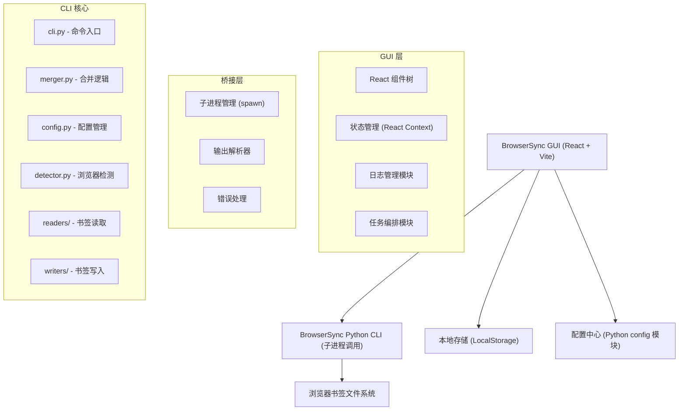

## 1. 架构设计



## 2. 技术选型

- **前端框架**：React 18 + TypeScript
- **构建工具**：Vite 5
- **样式方案**：Tailwind CSS 3
- **状态管理**：React Context + useReducer
- **图标库**：Lucide React
- **路由**：React Router v6
- **桥接方式**：通过 Node.js 子进程调用 Python CLI（`python3 -m browsersync.cli`），实时捕获 stdout/stderr 流
- **日志存储**：IndexedDB（通过 idb 库）持久化历史执行日志
- **部署**：静态站点，通过 Electron 或单纯浏览器打开

## 3. 路由定义

| 路由 | 页面 | 说明 |
|------|------|------|
| `/` | 仪表盘 | 默认首页，浏览器概览与快捷操作 |
| `/sync` | 同步工作台 | 完整同步流程引导 |
| `/merge` | 合并/镜像管理 | 独立的合并/镜像操作 |
| `/push` | 推送管理 | 独立的推送操作 |
| `/config` | 配置中心 | 浏览器和偏好设置 |
| `/logs` | 日志控制台 | 执行历史与日志查看 |

## 4. 桥接层设计

### 4.1 子进程管理

```typescript
// 子进程调用封装
interface CliExecution {
  id: string;
  command: string;
  args: string[];
  status: 'running' | 'completed' | 'failed' | 'cancelled';
  exitCode: number | null;
  stdout: string[];
  stderr: string[];
  startedAt: string;
  completedAt: string | null;
}

interface CliExecutor {
  execute(cmd: string, args: string[]): Promise<CliExecution>;
  cancel(executionId: string): void;
  onLog(executionId: string, callback: (line: string) => void): void;
}
```

### 4.2 输出解析规则

- 每行 stdout 输出作为日志流显示
- 使用正则表达式从输出中提取结构化数据（书签数量、浏览器名称等）
- 非零 exitCode 视为执行失败，stderr 内容作为错误信息展示

### 4.3 配置同步

- GUI 启动时读取 `~/.browsersync/config.yaml`
- 配置修改通过 `set-base`、`set-mode` 等 CLI 命令持久化，或直接写入 YAML 文件
- 配置变更后自动刷新 GUI 状态

## 5. 组件架构

```
src/
├── main.tsx                    # 入口
├── App.tsx                     # 根组件 + 路由
├── index.css                   # 全局样式 + Tailwind
│
├── components/
│   ├── layout/
│   │   ├── Sidebar.tsx         # 左侧导航栏
│   │   ├── Header.tsx          # 顶部标题栏
│   │   └── Layout.tsx          # 整体布局容器
│   │
│   ├── dashboard/
│   │   ├── BrowserCard.tsx     # 浏览器信息卡片
│   │   ├── BrowserGrid.tsx     # 浏览器卡片网格
│   │   └── QuickActions.tsx    # 快捷操作区域
│   │
│   ├── sync/
│   │   ├── StepIndicator.tsx   # 步骤指示器
│   │   ├── StepCollect.tsx     # 收集步骤
│   │   ├── StepMerge.tsx       # 合并/镜像步骤
│   │   └── StepPush.tsx        # 推送步骤
│   │
│   ├── merge/
│   │   ├── ModeSelector.tsx    # 模式选择 (merge/mirror)
│   │   ├── BaseBrowserSelect.tsx # 基准浏览器选择
│   │   ├── MergePreview.tsx    # 合并预览
│   │   └── BrowserCheckboxGroup.tsx # 浏览器多选组
│   │
│   ├── push/
│   │   ├── BrowserTargetList.tsx # 目标浏览器列表
│   │   └── PushResult.tsx      # 推送结果展示
│   │
│   ├── config/
│   │   ├── BrowserConfig.tsx   # 浏览器配置
│   │   └── Preferences.tsx     # 偏好设置
│   │
│   ├── console/
│   │   ├── LogViewer.tsx       # 日志查看器
│   │   ├── LogLine.tsx         # 单行日志
│   │   └── LogToolbar.tsx      # 日志工具栏
│   │
│   └── shared/
│       ├── Button.tsx          # 通用按钮
│       ├── Card.tsx            # 通用卡片
│       ├── Select.tsx          # 下拉选择
│       ├── Toggle.tsx          # 开关组件
│       ├── Spinner.tsx         # 加载动画
│       └── EmptyState.tsx      # 空状态
│
├── contexts/
│   ├── ConfigContext.tsx       # 配置状态
│   ├── ExecutionContext.tsx    # 执行状态
│   └── LogContext.tsx          # 日志状态
│
├── services/
│   ├── cli.ts                  # CLI 子进程管理
│   ├── config.ts               # 配置读写
│   └── logStorage.ts           # 日志持久化
│
├── types/
│   └── index.ts                # TypeScript 类型定义
│
└── utils/
    ├── formatters.ts           # 格式化工具函数
    └── parsers.ts              # CLI 输出解析函数
```

## 6. 数据模型

### 6.1 模型定义

```typescript
// 浏览器信息
interface BrowserInfo {
  name: string;
  type: 'chromium' | 'safari';
  path: string;
  enabled: boolean;
  bookmarkCount: number | null;
}

// 配置
interface AppConfig {
  browsers: BrowserInfo[];
  baseBrowser: string | null;
  mode: 'merge' | 'mirror';
  backupDir: string;
  logDir: string;
  mergeOutput: string;
}

// 执行记录
interface ExecutionRecord {
  id: string;
  command: string;
  args: string[];
  status: 'running' | 'completed' | 'failed' | 'cancelled';
  exitCode: number | null;
  stdout: string[];
  stderr: string[];
  startedAt: string;
  completedAt: string | null;
  duration: number | null;
}

// 合并预览
interface MergePreview {
  before: Record<string, number>;
  after: number;
  saved: number;
  baseBrowser: string;
}
```

### 6.2 IndexedDB 存储结构

| 存储名称 | Key | 说明 |
|---------|-----|------|
| execution_logs | id (autoIncrement) | 执行历史记录 |
| config | id | 缓存的配置快照 |

## 7. 关键技术决策

1. **子进程桥接而非改写 CLI**：保持 CLI 核心逻辑不变，GUI 通过 `python3 -m browsersync.cli <args>` 调用子进程，捕获 stdout/stderr 流实现实时日志
2. **无后端服务器**：GUI 直接通过桥接层操作本地文件系统和 CLI，不引入额外服务端依赖
3. **IndexedDB 日志持久化**：执行历史存储于浏览器本地，无需后端数据库
4. **配置双向同步**：GUI 修改配置后同时更新 YAML 文件和内存状态，保证 CLI 和 GUI 配置一致性
